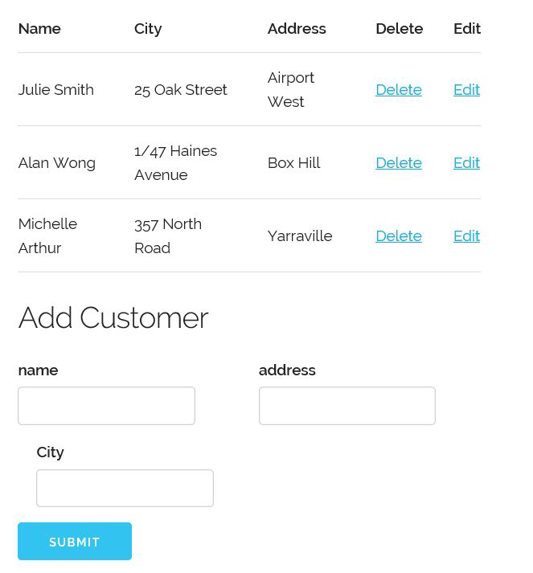
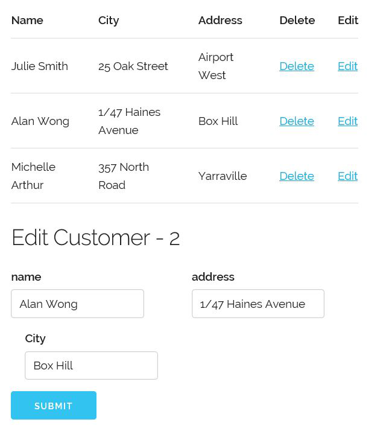

# This is a RESTful Web Service built with Server Side PHP

## You can do various CRUD (Create, Read, Update, Delete) operations:
## 1. It pulls the data using the RESTAPI

## 2. You can edit, delete the data as well

## 3. It is a simple illustration of how REST can make the communication between the client and server so easy.

### In order to start this, please import the required files from the repository
### Then using any IDE supporting PHP, navigate to inc/config.inc.php and change the const API_URL to your localhost url. Make sure it calls the RestAPI file.
### Then (if you like you can install wampserver) to run the SimpleWebService.php file. Make sure you add the alias in Apache for the file directory.

### Thanks for checking in. Happy Coding.
